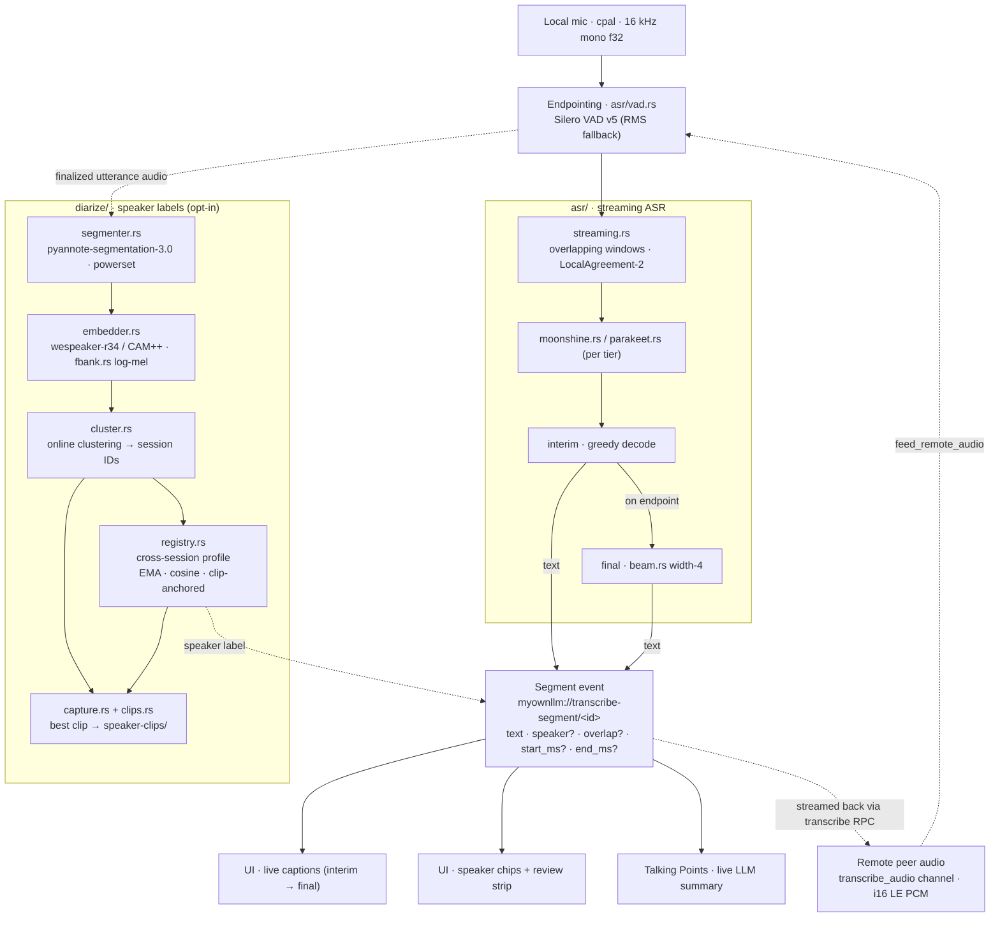

# MyOwnLLM Architecture

## What MyOwnLLM is

**MyOwnLLM is a local API surface for local AI — and a peer mesh that turns every device you own into more capacity.** A single binary exposes an OpenAI-compatible HTTP API on `127.0.0.1` that resolves "what model should I run on this machine?" against a JSON file you (or someone else) host. The GUI and CLI are two clients of that same surface; nothing in the design assumes a human is watching.

The **Cloud Mesh** is the distributed-intelligence half. The transport — discovery, mutual ed25519 auth, WebRTC + ICE, signaling resilience, governance — lives in the separate [`myownmesh`](https://github.com/mrjeeves/MyOwnMesh) daemon. MyOwnLLM bundles `myownmesh serve` as a Tauri sidecar; the LLM's Rust backend either spawns it or attaches to an already-running shared daemon (`~/.myownmesh/daemon.sock` first, `~/.myownllm/daemon.sock` second), talks to it over a line-delimited JSON control socket, and forwards the daemon's event stream to the frontend as `mesh://event`. The LLM owns only the LLM-specific protocol on top: remote inference, file transfer, conversation move + remote-session view, transcribe, and capability + catalog + permissions + prompts gossip — each layered on the daemon's RPC + typed-channel primitives. Routing is **per-surface and persistent** — each pane has its own host pin, stored by device pubkey so reconnects and reloads don't drop it. A pinned peer dropping pauses the work tied to it instead of silently downgrading to the local LLM the user didn't pick.

The "centralized" piece is decentralized by construction: the source of truth for which models a team uses is a static JSON file at a URL the team controls. Any host (GitHub Pages, S3, an internal HTTP server) is sufficient. Manifests can `import` other manifests to compose merged family lists across publishers.

## One picture

```
   HTTP clients ───────►  ┌──────────────────────────────────────────────────┐
   (Cursor, Continue,     │   myownllm (single binary)                       │
    Aider, agents,        │                                                  │
    your scripts)         │   axum API   (default :1473) ◄── primary surface │
                          │      │                                           │
                          │      ▼                                           │
                          │   resolver    (virtual ID → tag)                 │
                          │     │   ▲                                        │
                          │     │   │ per-file TTL, recursive imports        │
                          │     │   │ (manifests with families)              │
                          │     ▼   │                                        │
                          │   fetch & cache (~/.myownllm/cache)              │
                          │      │                                           │
                          │      ▼                                           │
                          │   preload     (pull, warm, ensure_tracked_models)│
                          │   watcher     (5-min ticks; hot-swap on update;  │
                          │                self-update check)                │
                          │      │                                           │
                          │      ▼                                           │
                          │   ollama.rs   (manage `ollama serve` child)      │
                          │                                                  │
                          │   mesh/daemon.rs ──► IPC ──► myownmesh sidecar   │
                          │     (control socket; event forwarding to UI)     │
                          │                                                  │
                          │   CLI         ◄── thin client of the same core   │
                          │   GUI (Tauri) ◄── thin client of the same core   │
                          └──┬──────────────────────┬────────────────────────┘
                             │                      │
       subprocess +          │                      │ subprocess +
       HTTP 127.0.0.1:11434  ▼                      ▼ ~/.myownllm/daemon.sock
                  ┌──────────────┐         ┌──────────────────────────────┐
                  │   Ollama     │         │   myownmesh serve            │
                  └──────────────┘         │   (WebRTC + Nostr signaling) │
                                           └──────────────────────────────┘
```

The same Rust binary handles three personas, picked at process-start by argv:

| Invocation       | Persona                                                          |
|------------------|------------------------------------------------------------------|
| `myownllm serve`    | Headless OpenAI-compat server (the primary use case)             |
| `myownllm <cmd>`    | CLI (status, models, providers, families, preload, import/export) |
| `myownllm`          | GUI (Tauri); also runs the API server alongside                  |

## The provider/family ecosystem

One kind of JSON file:

- **Manifest** — `{ name, version, ttl_minutes?, default_family, families: { ... }, imports?, headroom_gb?, shared_modes? }`. Each family declares its own `default_mode` and per-mode tier table; the resolver walks `families[active_family].modes[active_mode].tiers` against the local hardware. The user picks active provider + active family; the rest is automatic.

`imports` is an array of URLs to other manifests. The fetcher walks them recursively, dedupes by URL, detects cycles, and merges family maps in document order (the importing file's own families win on key collision). **Each imported file is fetched and cached against its own `ttl_minutes`** — the recursion does not flatten TTL, so a slow-changing top-level manifest can import a fast-moving one without the publisher having to coordinate.

That per-file TTL is also how publishers express rate-limit expectations: a manifest hosted on a free static host might say `ttl_minutes: 1440` to keep load down; a high-availability commercial endpoint might say `5`.

### Tier resolution and unified memory

A tier carries three RAM/VRAM thresholds because Apple Silicon and discrete GPUs behave differently:

- `min_vram_gb` — primary discrete-GPU path. Matches when `vram_gb >= min_vram_gb`. The number already includes KV-cache / activation overhead and any VRAM the paired transcribe runtime would also claim, so the resolver and the displayed "Needs ~X GB VRAM" hint use exactly the same number.
- `min_ram_gb` — last-resort CPU-fallback path on discrete GPU. Only consulted when the primary VRAM walk produced no hit at all (e.g. a 2 GB GPU staring at a ladder whose bottom rung needs 4 GB). Matches when `ram_gb - headroom_gb[gpu_type]` clears the bar; the model lives in system RAM and inference runs on CPU. Rare in practice — every shipped family ladder ends in a `min_vram_gb=0` rung, so the VRAM walk almost always matches first.
- `min_unified_ram_gb` — unified-memory path (Apple, integrated GPUs, CPU-only SBCs). Matches against raw RAM. The publisher has already factored in OS headroom and the paired transcribe model, so a single number captures "this machine can host text + audio together". Omitted on legacy tiers, in which case the resolver synthesises `min_ram_gb + headroom_gb[gpu_type]` so older manifests keep working.

**Two-pass walk (schema v19).** The resolver walks the ladder twice on discrete GPU: first for VRAM-fitting tiers (primary), then — only if nothing matched — for CPU-fittable tiers. The previous OR-fallback would silently promote a 24 GB 3090 to a 28 GB tier via system RAM, then display "Needs ~28 GB VRAM" the GPU couldn't deliver. The two-pass walk keeps the displayed hint honest: the recommended tier is always one the GPU can actually host, with CPU fallback called out explicitly in the Family detail header when it triggers.

`headroom_gb` is a manifest-level map (`apple`/`none`/`nvidia`/`amd` → GB) that reserves system overhead for the OS, WebView, ollama daemon, and the paired ASR model (Moonshine ~150 MB resident on Pi-class, Parakeet ~700 MB on capable hardware). Compiled-in defaults: `apple: 5, none: 2, nvidia: 1, amd: 1`. Apple is highest because macOS + browser tabs share the LLM pool; discrete-GPU hosts are lowest because the LLM lives on the card and system RAM only hosts the client. When diarization is enabled, the resolver subtracts an additional ~0.5 GB for the pyannote pipeline.

`shared_modes` lets a manifest publish canonical mode blocks once and have every family inherit them without redeclaring tiers. Today's default manifest ships four shared modes: **`transcribe`** (per-tier ASR runtime: Moonshine on the Pi rung, Parakeet on the capable rung), **`diarize`** (pyannote pipeline, opt-in via the transcribe pane's "Identify speakers" toggle), **`speak`** (per-tier TTS runtime: Piper on the lower rungs, Kokoro on the capable rung), and **`embed`** (an Ollama embedding model — EmbeddingGemma / Nomic / all-MiniLM per tier — tracked by default so Myo's memory system can fetch vectors via the `myownllm-embed` virtual ID). A family's own `modes[k]` always wins on collision, so a family can override any ladder without forking the schema.

**Per-tier `runtime` (schema v13).** `ManifestTier` carries an optional `runtime` field that overrides the mode-level default. This is how a single transcribe ladder promotes capable hardware to Parakeet while the bottom rung stays on Moonshine. Resolution order: `tier.runtime` → `mode.runtime` → `default_runtime_for(mode)` (`transcribe → moonshine`, `diarize → pyannote-diarize`, everything else → `ollama`).

## Modules (Rust)

| File | Role |
|------|------|
| `main.rs` | argv branching; setup hook spawns watcher, self-update checker, and API server. |
| `cli.rs`  | Every CLI subcommand. |
| `api.rs`  | axum router, virtual-ID resolution, pull-on-demand, model rewrite. |
| `api_models.rs` | OpenAI-compatible request/response types. |
| `resolver.rs` | Manifest fetch + per-file TTL cache, recursive imports with cycle detection, family + hardware-tier walk, virtual-ID map. Mirrors `src/manifest.ts`. |
| `preload.rs` | `preload(modes, …)` + `ensure_tracked_models()` reconcile loop. |
| `watcher.rs` | Background ticker (every 5 min) that re-runs `ensure_tracked_models`, recomputes model-status, and triggers `self_update::tick`. Process lock at `~/.myownllm/watcher.lock`. |
| `self_update.rs` | Periodic GitHub-releases check, channel-aware (stable/beta), patch auto-apply, atomic rename-on-restart, package-manager-install detection (no-op when installed via brew/apt/rpm/MSI). |
| `hardware.rs` | nvidia-smi / rocm-smi / sysctl / /proc detection. |
| `ollama.rs` | spawn/stop `ollama serve`, pull, list, delete, warm, has_model. |
| `purge.rs` | Danger-zone resets: `purge_models` / `purge_conversations` / `purge_all`. Shared between the Storage tab's "Danger zone" Tauri commands and `myownllm purge` in the CLI. |
| `transcribe.rs` | Live transcription orchestrator. Owns mic capture (cpal), the streaming decode loop, endpointing, interim→final caption emission, and the diarize-in-loop wiring; emits segments on `myownllm://transcribe-segment/<id>`. Also drives the remote (mesh-host) path via `*_remote_session` / `feed_remote_audio`. Carries the `[perf]` instrumentation — realtime factor, per-stage timings, backlog, mic level / VAD probability — gated on `MYOWNLLM_PERF` (default on; logs to stderr + `~/.myownllm/perf.log`). |
| `asr/` | Speech-to-text backends + streaming policy. `streaming.rs` — overlapping-window decode with **LocalAgreement-2** (commit the prefix two successive hypotheses agree on) for stable interim→final captions, plus the RMS `SilenceEndpointer` fallback. `vad.rs` — **Silero VAD v5** neural endpointing (replaces the RMS gate; falls back to RMS on load/inference failure). `moonshine.rs` — UsefulSensors Moonshine v2 (raw-PCM encoder/decoder ONNX; greedy interim decode, length-bounded per chunk). `parakeet.rs` — NVIDIA Parakeet TDT 0.6B v3 (25 languages). `beam.rs` — width-4 beam search for finalized utterances (greedy still drives the live interim text). |
| `diarize/` | Speaker diarization + cross-session **Speaker Profiles**. `segmenter.rs` — pyannote-segmentation-3.0 (powerset per-frame speaker activity on 10 s windows). `embedder.rs` — wespeaker-r34 / CAM++ speaker embeddings (`fbank.rs` = kaldi-compatible log-mel features). `cluster.rs` — online unit-hypersphere clustering (stable IDs within a session). `registry.rs` — durable cross-session registry (EMA centroids, cosine match, anchored-to-verified-clips, atomic JSON write, TTL eviction). `capture.rs` — opportunistic best-clip capture per speaker; `clips.rs` — on-disk WAV clip store under `speaker-clips/`. |
| `mesh/` | Cloud Mesh substrate. The transport itself (identity, signing, roster, networks, WebRTC + ICE, signaling, governance, peer-level RPC + typed channels) is the [MyOwnMesh](https://github.com/mrjeeves/MyOwnMesh) daemon — bundled as a Tauri sidecar via `build.rs` and pinned by `.myownmesh-rev`. `daemon.rs` spawns (or attaches to) `myownmesh serve` at startup with `MYOWNMESH_HOME=~/.myownllm` so existing users keep their pubkey + roster files; the detect-and-share order is `~/.myownmesh/daemon.sock` (shared with the MyOwnMesh GUI when running), then `~/.myownllm/daemon.sock` (LLM-owned). A `ControlClient` over the daemon's line-delimited JSON IPC socket dispatches requests; the daemon's event stream is forwarded to the frontend as `mesh://event`. `daemon_commands.rs` exposes 30 thin Tauri commands covering the full daemon IPC surface (`mesh_daemon_status`, identity, networks, peers + roster, governance, RPC register/call/respond/stream, channel subscribe/send, capabilities). The legacy single-file Rust mesh module — `identity.rs`, `signing.rs`, `roster.rs` — is a thin re-export of `myownmesh_core` (same `~/.myownllm/.secrets/identity.json` and `~/.myownllm/mesh/rosters/{network_id}.json` layout) so headless CLI ops + tests still work without a running daemon. `commands.rs` retains a small surface of GUI-side helpers (`mesh_file_save_at` for user-confirmed writes, identity label set / Network ID normalize); the LLM-specific protocol on top of the daemon (capability advertisement, catalog gossip, remote inference, file transfer, Move, transcribe) lives in the TS layer (`src/mesh-*`). `governance.rs` houses the LLM-side helpers for the daemon's signed-proposal governance flow. |

## Modules (TypeScript)

The TS layer is the GUI's source of truth. The Rust layer reads the same on-disk caches/config so headless commands work without booting Node.

| File | Role |
|------|------|
| `config.ts` | Read/write `~/.myownllm/config.json` with default-merge for upgrades. |
| `manifest.ts` | `getManifest(url)` (per-file TTL cached, recursive imports), `resolveModel`, `pickFamily`, `familyModes`, `allRecommendedModels`. |
| `providers.ts` | CRUD over saved providers, plus `getActiveFamily` / `setActiveFamily`. |
| `model-lifecycle.ts` | `recomputeRecommendedSet`, `runCleanup`, `pruneNow`, `markEvictedNow`. |
| `import-export.ts` | Bundle config to/from `myownllm:import:…` URLs. |
| `preload.ts`, `watcher.ts` | Thin Tauri-invoke wrappers for the Rust counterparts. |
| `mesh.ts`, `mesh-state.svelte.ts` | Cloud Mesh Rust bindings + reactive UI state. `mesh.ts` wraps the identity / Network ID Tauri commands the GUI uses outside of the daemon's reactive store. `mesh-state.svelte.ts` caches the identity readout for the session and exposes `ensureLoaded()` for the Cloud Mesh settings tab. |
| `mesh-protocol.ts` | LLM-specific wire-protocol types + pure helpers. `Capabilities` shape (LLMs with `family`/`mode`/`context_length` / ASR / diarize / hardware / inputs / outputs / accepting / `app_version` / `features`), `CatalogEntry`, `APP_VERSION`, the `FEATURES` registry (stable string ids for optional capability flags, including `REMOTE_TRANSCRIBE`), `ADVERTISED_FEATURES` (what this build supports), `peerSupportsFeature(cap, id)`, `summarizePeerCompat(cap)`. The legacy `MeshMessage` union remains exported as a reference of the on-the-wire payload shapes the LLM-specific protocol uses, but actual transport is via daemon RPC + typed channels — there is no JSON-over-data-channel frame layer in the TS layer anymore. No runtime state; safe to import from anywhere. |
| `mesh-capabilities.ts` | Snapshots the local capability surface (`detect_hardware` + `ollama_list_models` + `asr_models_list` + `audio_input_devices`) into the wire `Capabilities` shape — stamps in `APP_VERSION` + `ADVERTISED_FEATURES` on every snapshot. Provides `summarizeCapabilities`, `capabilityBadges`, `canServeInference`, `canServeTranscribe`, `resolvePeerLlm` (mirrors the handler's pick-by-(family,mode) so the UI can predict the chosen tag for context-tracker display), and `formatPeerCompat(cap)` / `describePeerMissingFeatures(cap)` for the Connections card. |
| `mesh-daemon.svelte.ts` | The frontend's only handle on the mesh substrate. Subscribes to `mesh://event` (peer / phase / diag frames + RPC inbound + channel inbound), reshapes the daemon's `PeerInfo` into the legacy `PeerEntry` shape the UI binds to (unwrapping the LLM `Capabilities` blob from `CapabilityAdvert.extra`), maintains reactive `peers`, `phase`, `diag`, `files`, `inbound_offers`, `resources`. `start()` bootstraps the daemon's joined-network set from the frontend config, installs per-feature handlers (inference, file, transcribe, move), subscribes to the gossip channels (catalog, permissions, prompts), wires `agentPermissions.setBroadcaster` / `agentPrompts.setBroadcaster` so local edits gossip out, hydrates `autoGossipEnabled` from saved config, and kicks off a 60s periodic catalog + perms/prompts refresh tick. Public methods: `reconcile`, `start`, `stop`, `approveRequest`, `denyRequest`, `removePeer`, `forceRediscovery`, `setAccepting`, `setAutoGossip`, `setDiagQuiet`, `noteCapabilitiesChanged`, `noteCatalogChanged` (500ms-debounced), plus single-line forwards to the feature modules: `sendInferRequest`, `sendTranscribeRequest`, `sendFile`, `acceptInboundFile`, `declineInboundFile`, `moveConversation`, `pullConversation`, `fetchRemoteSession`, `saveRemoteSession`. Daemon-IPC primitives the feature modules use directly: `registerRpcHandler`, `callRpc`, `callRpcStream`, `subscribeChannel`, `channelSendAll`, `channelSendTo`, `pushCapabilities` (packs LLM `Capabilities` into `CapabilityAdvert.extra` for the daemon round-trip), `respondRpc` / `streamRpcChunk` / `streamRpcEnd`. |
| `mesh-inference.ts` | Remote inference. Caller `sendInferRequest` opens a streaming RPC on method `infer` and concatenates chunk callbacks (`delta` / `thinking_delta` / `tool_call`); handler `installInferenceHandler` claims the `infer` method and routes inbound payloads to local Ollama via the existing `myownllm://chat-stream/<id>` event bus, forwarding each frame back as a stream chunk. Cancellation rides the daemon's stream-drop. |
| `mesh-file.ts` | Arbitrary file transfer (≤ 500 MB). Two pieces: a single-shot `file_offer` RPC (sender asks; receiver shows accept/decline dialog + save-path picker) and a per-transfer typed channel `file_chunks/<id>` carrying 48 KB base64 PCM chunks. A degenerate `file_send` streaming RPC delivers the end-of-stream signal once the channel chunks finish. SHA-256 (base32-encoded) verified on assemble. |
| `mesh-move.ts` | Conversation move + remote-session view. Four single-shot RPCs: `session_fetch` (read a peer's conversation by guid — click-to-open without copying), `session_save` (push an updated conversation back to its host after a remote-session turn), `move_take` (transfer ownership; receiver writes locally + acks; sender deletes), `move_drop` (ask source to delete its copy after Pull). Source folder is preserved across the move. |
| `mesh-transcribe.ts` | Remote ASR. One streaming `transcribe` RPC (handler streams `SegmentPayload` chunks back) + one per-call typed channel `transcribe_audio/<request_id>` carrying base64 PCM audio chunks (16 kHz mono i16 LE) from sender to handler. The handler bridges into the existing Rust transcribe pipeline via two Tauri commands (`transcribe_start_remote_session` / `transcribe_feed_remote_audio`); local Rust emits segments on `myownllm://transcribe-segment/<session_id>` which the handler forwards as stream chunks. |
| `mesh-gossip.ts` | Three gossip flows over typed channels. `catalog/announce` ships the full local conversation list (debounced via `noteCatalogChanged` + 60s periodic tick); receivers update the matching `PeerEntry.catalog`. `permissions/snapshot` ships the per-tool gates (`{tools: {shell, write_file}}`) the user has set, gated outbound + inbound on the active network's `auto_gossip` flag; receivers feed into `agentPermissions.mergeIncoming` (per-tool LWW by `updated_at`). `prompts/snapshot` mirrors the same shape for the per-network prompt library, merged via `agentPrompts.mergeIncoming` (per-id LWW). Capabilities use the daemon's own `capabilities_update` broadcast — not a typed channel — via `pushCapabilities` packing the LLM blob into `CapabilityAdvert.extra`. |
| `mesh-governance.ts` | LLM-side helpers for the daemon's signed-proposal governance flow (closed-network ratify / deny / propose). Thin passthroughs to the `mesh_daemon_governance_*` Tauri commands; signing happens inside the daemon. |
| `ui/TopBar.svelte`, `TextBar.svelte`, `TranscribeBar.svelte`, `ModelSelector.svelte` | Workspace chrome. TopBar (hamburger + Text/Transcribe mode buttons with slot status indicators + Settings icon) replaces the old StatusBar. TextBar (model selector + brain toggle + context ring) replaces the bottom row of the old ModeBar. TranscribeBar (model selector only) renders twice in transcribe mode — under each pane. ModelSelector is the reusable picker shared across all three: renders as a styled pill when local-only and as a `<select>` once any peer can serve the kind, taking and emitting a stable `device_pubkey` so pins survive daemon reconnects. |
| `ui/routing-pins.svelte.ts` | Per-surface routing pins (`text` / `transcribe` / `tp`), each a `device_pubkey \| null`. Persisted in localStorage so reloads and peer hops don't drop them. Three exported setters (`setTextPin`, `setTranscribePin`, `setTpPin`) write through the in-memory `$state` and the on-disk copy. Parent surfaces resolve the pubkey to a current `meshClient.peers` entry at send / cycle time — if the peer is offline the surface pauses (TP) or errors inline (chat / transcribe) rather than silently falling back to the local LLM. |
| `ui/settings/CloudMeshSection.svelte` | Sub-tab strip for the **Networks** settings tab (renamed from "Cloud Mesh"; internal id stays `cloud-mesh`). Renders seven panes: **Status** (identity, status pill, accepting / auto-gossip toggles, saved networks, pending requests), **Settings** (per-network signaling / STUN / TURN, addresses + import/export), **Connections** (ring + indirect + resource map), **Graph** (node-map visualisation of the live mesh topology), **Governance** (closed-network proposal + ratify flow against the daemon), **Activity** (diagnostic log), **HTTP** (the axum-served browser UI, previously labeled "LAN"). Takes an `initialSubTab` prop so deep-links from `settingsRoute` land on the right pane. |
| `ui/settings/CloudMeshStatus.svelte` | Home view: single-line identity card (label · suffix · device_id), status pill with inline accepting dropdown + auto-gossip toggle, saved-networks list with Switch (inactive rows) and Forget (every row, guarded by a confirmation modal), + Add network button, pending Network requests when present. Includes inline hint when 3+ pending requests pile up (steer toward a more unique Network ID). |
| `ui/settings/CloudMeshConnections.svelte` | Read-only mesh surface: the Ring (active routed peers), Indirect (shelved + offline rostered), Resources in use (live inference + move rows). The cross-device conversation catalog lives in the main sidebar — each connected peer is an expandable group there with Pull / Push / Settings context-menu actions. |
| `ui/settings/CloudMeshNodeMap.svelte` | Force-directed graph of the live mesh — peers as nodes, ICE candidate-pair classification (`host` / `srflx` / `relay`) as edge styling. Anchors "you" centrally; LAN-direct pairs sit near, TURN-relayed pairs sit far. |
| `ui/settings/CloudMeshGovernance.svelte` | Closed-network governance UI. Proposes / ratifies / denies signed roster changes against the daemon's governance state machine; the daemon owns proposal storage + signing. |
| `ui/settings/CloudMeshActivity.svelte` | Ring-buffered diagnostic log (info/warn/error levels) with a quiet-logs checkbox that suppresses `info` events. Surfaces the daemon's diag stream forwarded over `mesh://event`. |
| `ui/settings/AddNetworkModal.svelte` | Single-input modal (Network ID + Generate) for saving a new mesh network. Two save modes: Save (don't activate) and Save & activate. ⌘/Ctrl + Enter shortcut on Save & activate. Mounted from the Status tab's "+ Add network" button. |
| `ui/settings-route.svelte.ts` | Cross-component "open settings" request channel. Sidebar calls `settingsRoute.open("cloud-mesh", { meshSubTab: "connections" })`; whichever main surface is mounted (Chat / TranscribeView) reads the signal via `$effect`, copies it into its local `settingsTab` state, and clears the signal. Avoids prop-drilling settings callbacks through both surfaces. |
| `settings-attention.svelte.ts` | Generic per-tab attention indicator registry. `SettingsPanel` renders dots from this store; the legacy `updateUi.available` signal is mirrored into it so the existing Updates dot keeps working through the unified path. New tabs that need a dot just call `settingsAttention.set(tabId, …)`. |
| `ui/*.svelte` | Svelte 5 UI. |

## Transcription pipeline

Both the local-mic and the remote-peer (mesh-host) paths feed the **same** in-process pipeline, orchestrated by `transcribe.rs`: endpointing decides utterance boundaries, the streaming ASR emits interim captions that firm up into a beam-searched final, and — when *Identify speakers* is on — the `diarize/` stages attach a speaker label before each segment is emitted on `myownllm://transcribe-segment/<id>`. The remote path swaps the mic for the `transcribe_audio` typed channel and streams the segments back over the `transcribe` RPC (see `mesh-transcribe.ts`); everything between is identical.

**Composer dictation (`ui/dictation.svelte.ts`).** The chat composer's mic is a deliberately lightweight tap on the *same* engine, not the full session machinery. Where the Transcribe view's `transcribe-state.svelte.ts` store drives the TopBar "Rec" chrome, per-conversation persistence, drain/recovery and Speaker Profiles, dictation runs its own ephemeral session: a fresh stream id, its own `myownllm://transcribe-stream/<id>` listener, `diarize_model: null`, `keep_audio: false`, and no conversation to save into. It folds the engine's interim→final captions straight into the textarea at the caret — interim text redraws in place, finals commit and advance the anchor — so it reads as live dictation you can stop and edit. Nothing is recorded; stopping is instant and the Rust session self-cleans its scratch buffer dir. It's a toggle, gated off whenever a heavyweight session already owns the mic (`transcribeUi.active`).

**Memory coordination on tight hosts.** Real-time ASR (plus diarize) and a resident chat LLM can't share one ~8 GB pool, so on memory-tight hosts the two are kept apart. `isTranscriptionMemoryTight()` (in `model-lifecycle.ts`) decides this from hardware: a discrete GPU with ≥ 8 GB VRAM holds the chat model off system RAM (no conflict, whatever the RAM), while unified-memory / CPU-only / small-VRAM hosts at ≤ 8 GB RAM are tight. When tight, starting a **Record/Upload** session first evicts the chat model (`ollama_unload` → Ollama `keep_alive: 0`), and `Chat` blocks chat sends (which would cold-load the model) until the session stops. Full-size machines are untouched, and lightweight composer dictation never trips either guard.



Same pipeline, plain-text (renders anywhere — terminals, plain diff viewers):

```
   local mic   cpal · 16 kHz mono f32
   remote peer transcribe_audio channel · i16 LE PCM
   └───────────────────────────────────┐
                                       │ feed_remote_audio
                                       ▼
 ┌────────────────────────────────────────────────────────────────────────────┐
 │ ENDPOINTING   asr/vad.rs                                                   │
 │   Silero VAD v5   (RMS SilenceEndpointer fallback)                         │
 └─────────────────────────────────────┬──────────────────────────────────────┘
                                       │ endpointed utterance
                   ┌───────────────────┴───────────────────┐
                   ▼ audio           audio (if diarize on) ▼
 ┌───────────────────────────────────┐   ┌────────────────────────────────────┐
 │ STREAMING ASR   asr/streaming.rs  │   │ DIARIZE   diarize/                 │
 │   overlapping windows ·           │   │   segmenter.rs  pyannote-seg-3.0   │
 │   LocalAgreement-2                │   │     ▼  embedder.rs   wespeaker /   │
 │   backend: moonshine.rs |         │   │     ▼     CAM++ (fbank.rs log-mel) │
 │            parakeet.rs            │   │     ▼  cluster.rs  → session IDs   │
 │   interim (greedy)                │   │     ▼  registry.rs cross-session   │
 │     ──▶ final (beam.rs · width-4) │   │          EMA·cosine·clip-anchored  │
 │                                   │   │   capture/clips → speaker-clips/   │
 └─────────────────┬─────────────────┘   └─────────────────┬──────────────────┘
                   │ text (interim → final)   speaker label│
                   └───────────────────┬───────────────────┘
                                       ▼
 ┌────────────────────────────────────────────────────────────────────────────┐
 │ SEGMENT EVENT   myownllm://transcribe-segment/<id>                         │
 │   { text, speaker?, overlap?, start_ms?, end_ms? }                         │
 └────────┬───────────────────┬─────────────────┬───────────────────┬─────────┘
          ▼                   ▼                 ▼                   ▼
   live captions          speaker chips     Talking Points     remote: streamed
   (interim →             + review strip    (live LLM loop)    back to peer via
    final)                                                     `transcribe` RPC
```

## Live update lifecycle

```
  Manifest URL changes (provider edit) or contents change (TTL refresh) or
  imported manifest changes (its own TTL refresh)
       │
       ▼
  watcher tick (5 min)  ── or ──  CLI provider/family mutation
       │
       ▼
  preload::ensure_tracked_models()
       │
       ├─ for each tracked mode: resolver::resolve(mode) → new tag
       │       │   (resolve fetches the manifest, recurses imports,
       │       │    each at its own TTL, merged in document order)
       │       │
       │       ├─ if tag not pulled  → ollama::pull_with(...)
       │       └─ if tag changed     → emit myownllm://mode-swap
       │
       ▼
  watcher::recompute_status_from_disk()
       │
       └─ writes ~/.myownllm/cache/model-status.json
              old tag's recommended_by becomes empty
              last_recommended timestamp = now (clock starts)
              model-lifecycle.runCleanup() will evict after model_cleanup_days
```

Hot-swap semantics: the OpenAI server reads `resolver::resolve(mode)` per request, so the next call after a swap hits the new tag transparently. In-flight streams keep using the old tag (Ollama keeps it loaded for `keep_alive`).

## Self-update lifecycle

```
  watcher tick (every 5 min)
       │
       ▼
  self_update::tick()
       │
       ├─ install kind?
       │     └─ homebrew / dpkg / rpm / MSI / chocolatey  → return (defer to PM)
       │     └─ raw binary on PATH                        → continue
       │
       ├─ HEAD https://api.github.com/repos/…/releases/{channel}
       │     (etag-cached; cheap when unchanged)
       │
       ├─ new tag, same major.minor → patch:  auto-apply
       │   new tag, different minor or major:  download, stage, notify
       │
       ├─ download asset for current platform
       ├─ verify SHA256 from release manifest
       ├─ stage at  ~/.myownllm/updates/<version>/myownllm(.exe)
       │
       └─ on next launch (or on SIGTERM if running as daemon):
             atomically rename staged binary over the running one
             (Windows: scheduled rename via MoveFileEx + restart)
```

Config (in `~/.myownllm/config.json`):

```jsonc
{
  "auto_update": {
    "enabled": true,
    "channel": "stable",          // "stable" | "beta"
    "auto_apply": "patch",        // "patch" | "minor" | "all" | "none"
    "check_interval_hours": 6,
    "stable_url": null,           // optional override; falls back to build-time default
    "beta_url": null              // optional override; falls back to build-time default
  }
}
```

Disabling: `myownllm update disable`, the "Automatic updates" toggle in the GUI's Settings → Updates tab, `auto_update.enabled = false` in config, or `MYOWNLLM_AUTOUPDATE=0` for a one-shot opt-out. When MyOwnLLM detects a package-manager install, the updater logs a one-line note and stays out of the way regardless of config.

Redirecting the release feed: set `auto_update.stable_url` / `auto_update.beta_url` in config, or bake new defaults into a build with the `MYOWNLLM_RELEASE_URL_STABLE` / `MYOWNLLM_RELEASE_URL_BETA` env vars at compile time (resolved via `option_env!` in `self_update.rs`, the same pattern `providers/preset.json` uses for shipping build-time provider defaults).

## Why no extra HTTP framework?

- **axum** for the server: tower-compatible, ergonomic streaming via `Body::from_stream`, ~3 MB stripped impact. Already paired with `reqwest` for upstream calls (rustls-tls so we don't pull OpenSSL on Linux).
- **No router for the GUI** — Tauri IPC handles that.
- **No global state crate** — `OnceLock<Mutex<…>>` covers the per-process locks we need (Ollama child handle, watcher start gate, preload mutex).

## Persistence

```
~/.myownllm/
├── config.json                       (user settings: providers, tracked_modes, api, auto_update,
│                                      cloud_mesh.networks[*] with their per-network
│                                      agent_permissions / prompts / accepting / auto_gossip)
├── watcher.lock                      (PID; cooperative process lock)
├── updates/                          (staged self-update binaries)
├── cache/
│   ├── manifests/<hash>.json         (manifest + fetched_at, per-URL — imports cached separately)
│   └── model-status.json             (recommended_by + last_recommended per tag)
├── .secrets/
│   └── identity.json                 (ed25519 keypair, 0600 on Unix — owned by myownmesh-core
│                                      via MYOWNMESH_HOME=~/.myownllm)
├── mesh/
│   └── rosters/{network_id}.json     (per-network approved peers; daemon-owned)
├── daemon.sock                       (LLM-owned myownmesh IPC socket; only present when no
│                                      shared ~/.myownmesh/daemon.sock was attached at startup)
├── transcribe-buffer/                (orphan ASR session chunks; cleared on launch)
├── speaker-registry.json             (cross-session Speaker Profiles: EMA centroids, names,
│                                      verified-clip anchors — atomic write, TTL eviction)
├── speaker-clips/                    (verified speaker voice-clip WAVs; referenced by
│                                      relative path from speaker-registry.json)
└── session-audio/                    (full-session WAVs, only when a conversation's
                                       "Keep audio" toggle is on)
```
